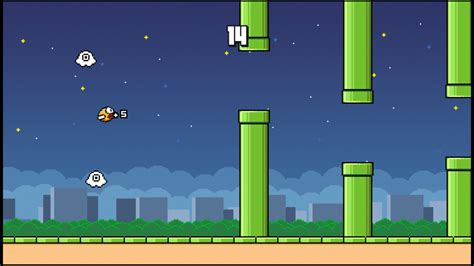
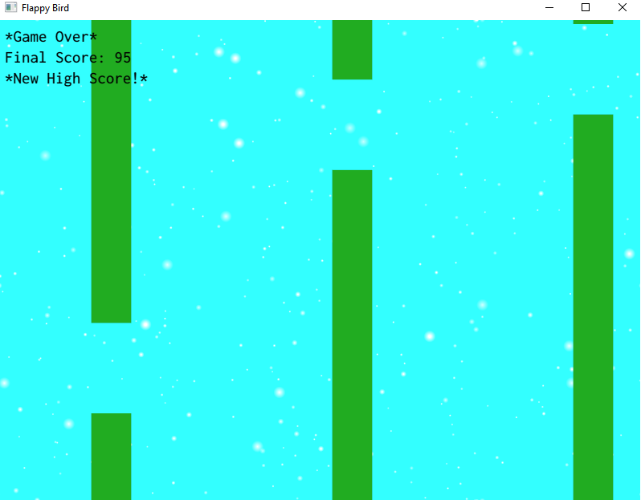
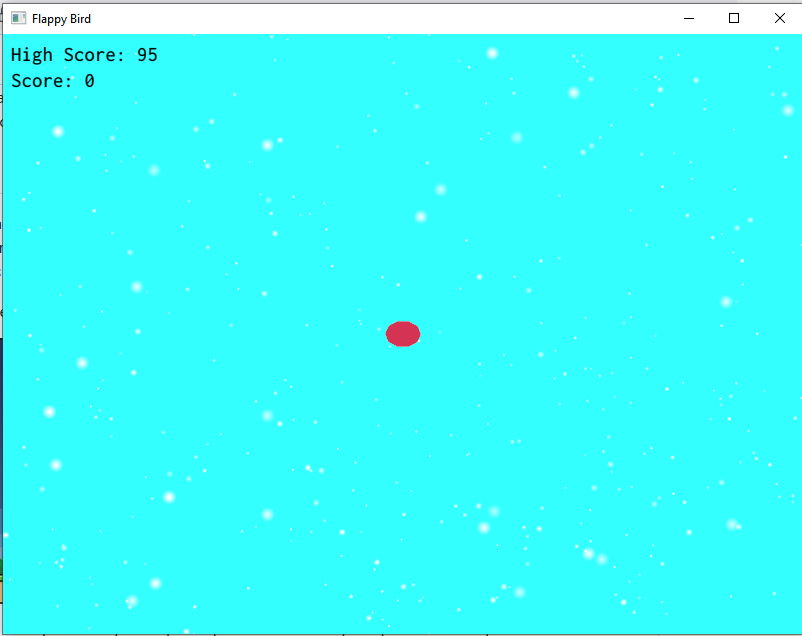
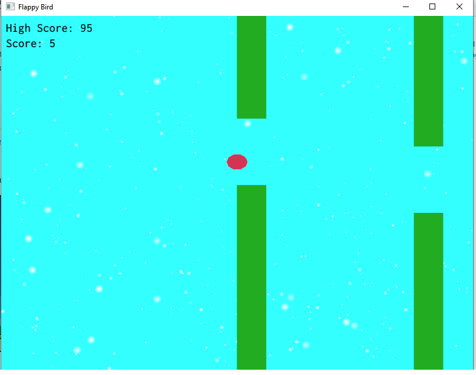

# cg_projeto1 - Flappy Bird

Atividade desenvolvida para a disciplina de computação Gráfica da UFABC - ministrada pelos docentes Bruno Augusto e Harlen Batagelo.

## Como foi feito

Seguindo exemplos passados em aula, foi possível iniciar um esboço de jogo simples em 2D. Por falta de conhecimento técnico por parte do discente, grande parte do que foi visto em aula foi reaproveitado e foi pensado um jogo simples para ser desenvolvido e compreendido.
  
Com isso em mente, foi decidido desenvolver um jogo no estilo Flappy Bird.
  

  
  
A princípio o que parecia ser extremamente simples, se tornou mais complexo do que o previsto.

### Tentativa de incluir imagens invés de apenas geometrias
  
O primeiro ponto que era desejado ao desenvolver o jogo, seria ao menos renderizar as imagens representado o pássaro, e os canos (também incluir um plano de fundo diferente). Após um tempo, foi possível carregar a imagem para ser utilizada no plano de fundo, créditos especiais a todos que desenvolveram a biblioteca de cabeçalho único STB, encontrada nesse link - https://github.com/nothings/stb/blob/master/stb_image.h

De maneira resumida, foi possível incluir este trecho no código:

	#define STB_IMAGE_IMPLEMENTATION
	#include "stb_image.h"

	// Simple helper function to load an image into a OpenGL texture with common settings
	bool LoadTextureFromFile(const char* filename, GLuint* out_texture, int* out_width, int* out_height) {
		// Load from file
		int image_width = 0;
		int image_height = 0;
		unsigned char* image_data = stbi_load(filename, &image_width, &image_height, NULL, 4);
		if (image_data == NULL)
			return false;

		// Create a OpenGL texture identifier
		GLuint image_texture;
		glGenTextures(1, &image_texture);
		glBindTexture(GL_TEXTURE_2D, image_texture);

		// Setup filtering parameters for display
		glTexParameteri(GL_TEXTURE_2D, GL_TEXTURE_MIN_FILTER, GL_LINEAR);
		glTexParameteri(GL_TEXTURE_2D, GL_TEXTURE_MAG_FILTER, GL_LINEAR);
		glTexParameteri(GL_TEXTURE_2D, GL_TEXTURE_WRAP_S, GL_CLAMP_TO_EDGE); // This is required on WebGL for non power-of-two textures
		glTexParameteri(GL_TEXTURE_2D, GL_TEXTURE_WRAP_T, GL_CLAMP_TO_EDGE); // Same

		// Upload pixels into texture
	#if defined(GL_UNPACK_ROW_LENGTH) && !defined(__EMSCRIPTEN__)
		glPixelStorei(GL_UNPACK_ROW_LENGTH, 0);
	#endif
		glTexImage2D(GL_TEXTURE_2D, 0, GL_RGBA, image_width, image_height, 0, GL_RGBA, GL_UNSIGNED_BYTE, image_data);
		stbi_image_free(image_data);

		*out_texture = image_texture;
		*out_width = image_width;
		*out_height = image_height;

		return true;
	}
  
Contudo, mesmo com essa biblioteca não foi possível pela parte discente deixá-la apenas no fundo, isto é, sem sobrepor os elementos restantes da tela. Mesmo tentando diversas vezes e com métodos como ImGui::Image() e ImGui::GetBackgroundDrawList.

Sem conseguir renderizar o plano de fundo, os outros objetos também foram deixados como formas geométricas.

### Pássaro e canos

Deixando a parte de cima de lado foi prosseguido para o desenvolvimento dos objetos de maneira mais visual. Seguindo o padrão Flappy Bird, a tela, e os objetos possuem cores mais vivas, diferentes do jogo Asteroids desenvolvido como exemplo. A parte de desenhar os objetos não foi tão trabalhosa, mas ocorreu um evento inesperado.

O intuito era ter deixado uma lista de canos desenhados na tela bem menor que o objetivo final (ex. desenhar 5 canos por vez invés de 100). Mas ocorreu algum problema ao tentar implementar a função de checagem dos canos fora da tela, que ela acabava desconfigurando os que ainda estavam por aparecer e travava a pontuação do jogo.
Isso é um "problema" que deverá ser corrigido futuramente, tanto que ainda se encontra comentado no código da opengl o trecho problemátco.

Um trecho para entender o funcionamento dos canos encontra-se abaixo:

	// Create Pipes
    m_lower_pipes.clear();
    m_upper_pipes.clear();
    m_lower_pipes.resize(quantity);
    m_upper_pipes.resize(quantity);

    float DIST_PIPES = 1.0f;

    float lower_x = 0.0f;
    float upper_x = 0.5f;
    float lower_y = 4.f; // since scale is set to 0.25f
    float upper_y = 0.f;

    for (size_t i = 0; i < m_lower_pipes.size(); i++) {
            m_lower_pipes[i] = createPipe(DIST_PIPES, lower_x, upper_x, lower_y, upper_y, false);
            m_upper_pipes[i] = createPipe(DIST_PIPES, lower_x, upper_x, lower_y, upper_y, true);
            DIST_PIPES += 0.75f;
    }

Os canos foram a parte que mais se destoou do projeto Asteroids, cada cano está representado como uma parte do todo. Existe um vector para representar os canos inferiores, e outro para representar os canos superiores, assim toda vez que vamos desenhar um novo cano na tela, já é invocada a função createPipe para os dois casos.

Os parametros de coordenadas lowerxy e upperxy, são responsáveis por manter o desenho de cada cano, um retângulo uniforme. E DIST_PIPES a distância desejada entre cada cano.

Por fim outro trecho interessante é como são criados os canos e mantida a distância entre eles.

	if (low_up) {
        lower_y = 4.f;
        upper_y = static_cast<float>(1.5 + upper_y);
        pipe.upper_y = upper_y / 4;
    }
    else {
        std::uniform_real_distribution<float> randomUY(-3.f, 2.5f);
        upper_y = randomUY(re);
        pipe.upper_y = upper_y / 4;
        lower_y = -4.f;
    }

A flag low_up representa qual parte está sendo desenhada, se verdadeira indica que o cano superior é o atual, se falsa, o cano inferior. O tamanho do cano superior é definido em função do inferior, pela expressão 1.5 + upper_y.

Existem alguns atributos como o pipe.upper_y que foi pensado para ser utilizado na redenderização dinâmica dos canos, mas acabou não dando muito certo, e os atributos ficaram para uso posterior e possível correção deste "problema".
  

### Colisões

Com os objetos desenhados, bastou fazer a parte de detecção de colisões. Foram feitas várias tentativas de utilizar os mesmos métodos que os professores deixaram disponíveis, mas mesmo tentando detectar a distância com a GLM, o raio considerado para a colisão estava muito alto (mesmo que tentasse reduzir multiplicando por uma constante, e acabou perdendo o sentido quando a constante teste ficou com um valor menor que 0.1). Portanto foi decidido uma abordagem mais simples para o jogo proposto. Calcular a distância do pássaro a qualquer um dos canos pelo eixo X *e* pelo eixo Y, assim quando as duas distâncias juntas apresentam um risco ao pássaro, a colisão é tida como verdadeira.

Um problema encontrado com essa abordagem é que a percisão de colisão é extremamente assertiva para casos de colisão frontal, já se o pássaro passou da metade do cano, a detecção de colisão tem um desempenho inferior.
Para corrigir isto, foi feita ainda outra verificação de colisão, desta vez utilizando distance da biblioteca glm.

	// Check collisions for bird and pipes
	int i = m_gameData.n_passed_pipes;
	float dist = 0.04f;
	do {
		if (i != m_gameData.n_passed_pipes) {
			const auto ldistance {glm::distance(m_bird.m_translation.x, m_pipes.m_lower_pipes[i].m_translation.x)};
			const auto udistance {glm::distance(m_bird.m_translation.x, m_pipes.m_upper_pipes[i].m_translation.x)};
			if ((ldistance < m_bird.m_scale * 0.85f + m_pipes.m_lower_pipes[i].m_scale * 0.85f 
				&& (m_bird.m_translation.y < m_pipes.m_lower_pipes[i].upper_y)) ||
				(udistance < m_bird.m_scale * 0.85f + m_pipes.m_upper_pipes[i].m_scale * 0.85f
				&& (m_bird.m_translation.y < m_pipes.m_lower_pipes[i].upper_y))) {
					m_gameData.m_state = State::GameOver;
					m_gameData.final_score = m_gameData.score;
					if (m_gameData.score > m_gameData.high_score) {
						m_gameData.high_score = m_gameData.score;
						m_gameData.hs = true;
					}
					m_restartWaitTimer.restart();
			}
		}

		const auto lower_distanceX = m_pipes.m_lower_pipes[i].m_translation.x;
		const auto upper_distanceX = m_pipes.m_upper_pipes[i].m_translation.x;

		if (((lower_distanceX > -dist && lower_distanceX < dist) && (m_bird.m_translation.y < m_pipes.m_lower_pipes[i].upper_y))
			|| ((upper_distanceX > -dist && upper_distanceX < dist) && (m_bird.m_translation.y > m_pipes.m_upper_pipes[i].upper_y))) {
			m_gameData.m_state = State::GameOver;
			m_gameData.final_score = m_gameData.score;
			if (m_gameData.score > m_gameData.high_score) {
				m_gameData.high_score = m_gameData.score;
				m_gameData.hs = true;
			}
			m_restartWaitTimer.restart();
		}
		i -= 1;
		// dist *= 2;
	} while (i >= 0 && i >= m_gameData.n_passed_pipes - 1);

Olhando rapidamente este código parece ser muito extenso e ineficiente para calcular colisões, mas foi a única solução encontrada que resolve o problema no primeiro momento, otimizações futuras podem ser feitas, mas note que este laço se repete apenas duas vezes, diferente do Asteroids que ocorre para cada asteroide na tela. E mesmo que pareça que deva ser um if else dentro dele, é o if e a "repetição" da checagem de colisão que permitem o funcionamento correto (e a repetição só é executada para o segundo parâmetro).
 
Por fim, alguns ajustes e refinamentos foram feitos para garantir que o jogo funcionasse sem problemas (pelo menos na versão local testada, no navegador houve lentidão no jogo - testado no navegador Microsoft Edge e no Opera, a velocidade com que o passáro sobe ou desce é muito inferior a de quando testada localmente. No Firefox o jogo não renderiza os canos).
 
## Resultado Final

O Resultado final ficou uma aplicação bem simples, simulando quase que inteiramente o jogo completo Flappy Bird. Como pode ser visto abaixo.

### Tela GameOver

### Tela enquanto se está parado

### Tela enquanto está jogando

Um detalhe é que nessa versão do jogo, é possível se movimentar para cima e para baixo também invés de aguardar a derrota sem poder fazer nada.

### Desenvolvido por

Thiago Silva das Mercês RA - 1120181014